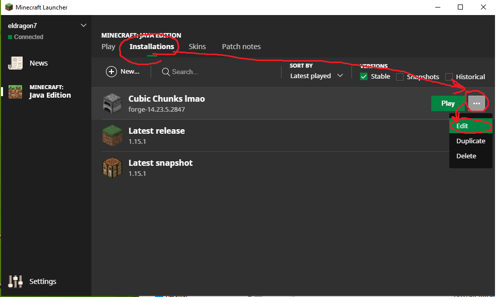
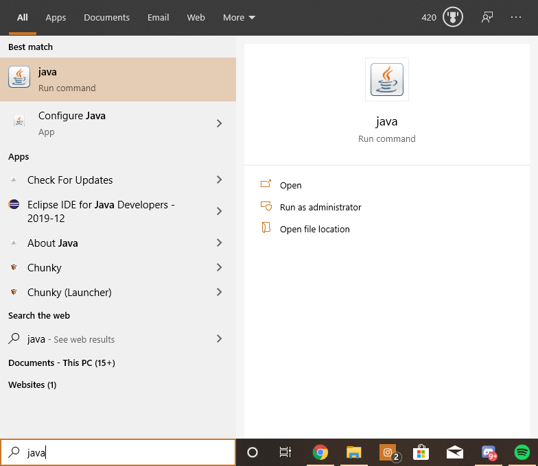
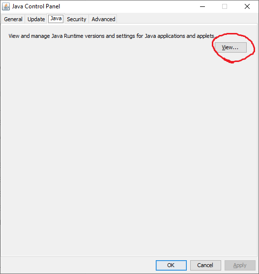
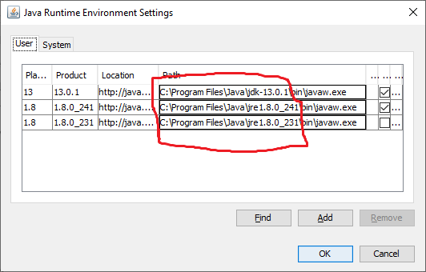

# Building Troubleshooting
### If you do not reach BUILD SUCCESSFUL during the building process
Most likely the Workspace was not created properly, or the build cache is on automatic garbage collection mode. You can try building the DecompWorkspace with an external cache (the workspace to allow code modification with referneces to outside libraries, and seeing if that allows the mod to compile by doing:

On Windows:

```bash
gradlew.bat setupDecompWorkspace 
```
On macOS/Linux
```bash
./gradlew setupDecompWorkspace
```
and try rebuilding by using:

On Windows:

```bash
gradlew.bat build -g TEST_CACHE_BUILD
```
On macOS/Linux:
```bash
./gradlew build -g TEST_CACHE_BUILD
```


# In-game/running Troubleshooting

## Where on earth am I?
As of current, when you spawn you will not be anywhere near any real-world position, also called Null Island. You will need to first teleport yourself to a world location, here are some example locations that might be of interest:

You can use some of our [Cool locations](COOL_LOCATIONS.md) to find somewhere interesting to teleport to.

## " java.lang.OutOfMemoryError: GC overhead limit exceeded", what is that, how do I fix?
You exceeded the amount of memory that the JVM (Minecraft's running environment) has to use, there are a lot of chunks in the cubic space, and a lot of blocks in those chunks. Especially considering that you will most likely be moving great lengths to get anywhere, you will a lot of memory available to the game to run properly. You can edit the JVM's memory allocation by changing the JVM arguments when it starts:

### JVM Arguments For the Client

Inside of Minecraft's Launcher, go to the Installations tab, find your installation of Forge, and select Edit:



Select **"More Options"**, and find the **"JVM Arguments"** section:


### JVM arguments For the Server

You will need change the launch command when opening your server, as listed in our [Server Run Instructions](USING_SERVER.md), an easy way is to create a "**.bat**" file in Windows, a "**.command**" file in Mac, or a "**.sh**" file in Linux in the same directory as the Forge Server and add this line:

```bash
<JAVA_HOME>/bin/java -Xmx####(suffix) -jar forge-<MCVERSION>-<FORGEVERSION>.jar
```


### -Xmx nomenclature for JVM arguments

Adding or changing the following value:

```
-Xmx####(suffix)
```
will change the amount of RAM that the JVM can use. **(Remember using a capital letter as the suffix is different from using a lowercase letter)**:

**-Xmx1G** is 1 gigabyte

**-Xmx8G** is 8 gigabytes

**-Xmx16G** is 16 gigabytes

......and so on.

However,

**-Xmx1g** is 1 gigabit (125 Megabytes)

**-Xmx8g** is 8 gigabit (1 Gigabyte)

**-Xmx16g** is 16 gigabit (2 Gigabytes, default Minecraft memory)
......and so on.

## "java.lang.NoSuchFieldError" for a func number or a missing biome
This error seems to originate with an uncompleted reference build, although Gradle will finish Building and the build will be successful, when it comes to run the mod, it Gradle builds with placeholder locations for references to other neccessary code, such as the code for Minecraft itself (like Biome information).

A good work around is to setup the Decompiliation cache on your system for Minecraft Forge Gradle, which decompiles Minecraft, Forge, and any extra libraries (the stuff in the lib folder). Normally just building should not need this step, unless you are intending to change the code of the mod, but it is a common workaround to this issue:

If you are on Windows:
```bash
gradlew.bat setupDecompWorkspace
```
If you are on macOS or Linux:
```bash
./gradlew setupDecompWorkspace
```
The build with the same commands as before:

If you are on Windows:
```bash
gradlew.bat build
```
If you are on macOS or Linux:
```bash
./gradlew build
```


## "Osm region download failed, no osm features will spawn, javax.net.ssl.SSLHandshakeException: sun.security.validator.ValidatorException: PKIX path building failed"

This is an issue with older Java versions that do not have the proper SSL certificates to access the [Overpass API](http://overpass-api.de/) used to load the OpenStreetMap data. You will most likely need to have a newer version of the JVM downloaded elsewhere and link it to the Java environment that Minecraft runs in (or you can change which Java Executable Minecraft uses to another JVM installation).

### Finding other JVMs on Windows

On Windows (vista or later), you can tell if you have other JVMs installed if you search "java" using the Windows search and if anything comes up at all:



If you select the "Configure Java" options this will open your system-wide Java installations, under the "Java" tab in that window, click "View"





You will see every major JVM you have installed to your machine. You only need up to the "**\bin**" part. (If you have multiple choose the newest under the 1.8 jurisdiction).

### Finding JVMs on Mac

It is the same instructions as on Windows, but instead of searching for JVM 

### Finding JVMs on Linux


Travel to that folder, inside of that folder, find the ""**lib**" folder, then "**security**", inside of that should exist a file called "**cacerts**", if it doesn't exist try installing another JVM (like the one we have below), or using another one installed to your machine (if you have more than one)

If you do not have any other JVMs installed, we recommend this [Java download](https://www.oracle.com/technetwork/java/javase/downloads/jre8-downloads-2133155.html), install the corrective version for your operating system and hardware. 

